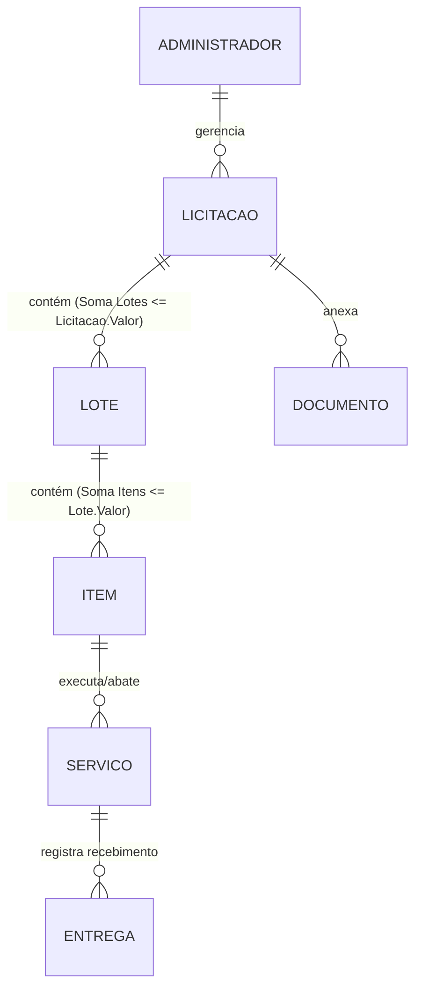

# Diagrama de Entidade e Relacionamentos (DER) - Prolicit

O sistema foi modelado para gerenciar licitações, dividindo-as em lotes e itens, e acompanhando a execução de serviços e entregas. O controle de acesso é feito por Administrador.

## Entidades e Relacionamentos

### 1. Administrador
- **Descrição**: Tabela base de usuários. Cada empresa possui um administrador.
- **Campos**: `id` (PK), `nome`, `email`, `senha`, `criado_em`.
- **Relacionamentos**:
  - `1:N` com **Licitacao** (Um admin gerencia várias licitações).
  - `1:N` com **Servico** (Um admin registra vários serviços).

### 2. Licitacao
- **Descrição**: O contrato ganho pela empresa.
- **Campos**: `id` (PK), `administrador_id` (FK), `numero_processo`, `orgao_publico`, `data_abertura`, `data_vigencia`, `valor_estimado`, `status` (Ativa/Finalizada), `tipo` (Serviços/Equipamentos/Ambos), `observacoes`, `criado_em`.
- **Regra de Negócio**: A soma do `valor_total_arrematado` de todos os lotes vinculados não pode ultrapassar o `valor_estimado`.
- **Relacionamentos**:
  - `1:N` com **Lote** (Uma licitação possui vários lotes).
  - `1:N` com **Documento** (Uma licitação possui vários documentos anexos).

### 3. Lote
- **Descrição**: Divisão financeira e estrutural da licitação.
- **Campos**: `id` (PK), `licitacao_id` (FK), `numero_lote`, `valor_total_arrematado`, `descricao`.
- **Regra de Negócio**: A soma do `(quantidade_ganha * valor_unitario)` de todos os itens vinculados não pode ultrapassar o `valor_total_arrematado`.
- **Relacionamentos**:
  - `1:N` com **Item** (Um lote possui vários itens).

### 4. Item
- **Descrição**: Os produtos ou serviços específicos dentro de um lote.
- **Campos**: `id` (PK), `lote_id` (FK), `descricao`, `quantidade_ganha`, `quantidade_executada`, `valor_unitario`.
- **Relacionamentos**:
  - `1:N` com **Servico** (Um item pode ser executado em várias etapas/serviços).

### 5. Servico
- **Descrição**: O registro da execução ou baixa de um item (ex: a entrega de um equipamento ou a realização de uma obra).
- **Campos**: `id` (PK), `item_id` (FK), `administrador_id` (FK), `nome_servico`, `valor_fixo`, `quantidade`, `data_execucao`, `descricao_detalhada`, `criado_em`.
- **Relacionamentos**:
  - `1:N` com **Entrega** (Um serviço pode ter várias entregas registradas).

### 6. Entrega
- **Descrição**: Comprovante de quem recebeu e quem entregou o serviço/produto.
- **Campos**: `id` (PK), `servico_id` (FK), `quem_recebeu`, `telefone`, `responsavel_entrega`, `data_recebimento`, `observacoes`, `criado_em`.

### 7. Documento
- **Descrição**: Arquivos, certidões e orçamentos vinculados à licitação.
- **Campos**: `id` (PK), `licitacao_id` (FK), `nome`, `tipo`, `arquivo_path`, `data_vencimento`, `criado_em`.

---

## Fluxo Lógico (Restrições)

